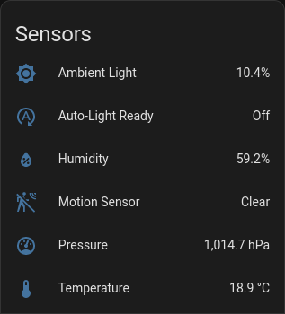
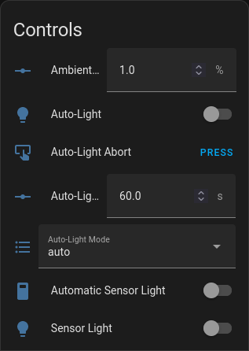
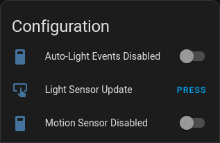
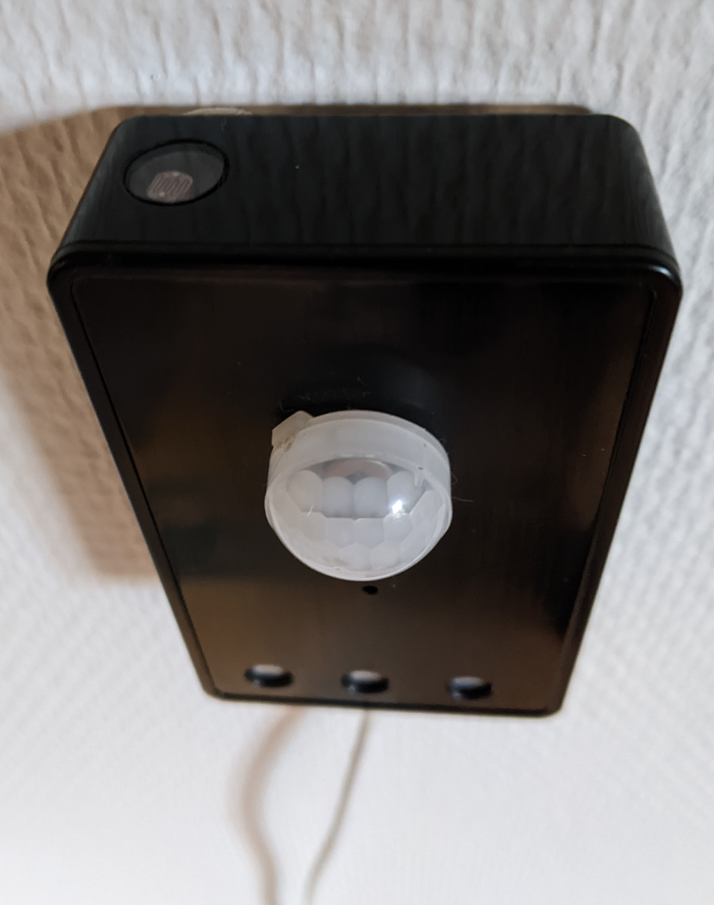
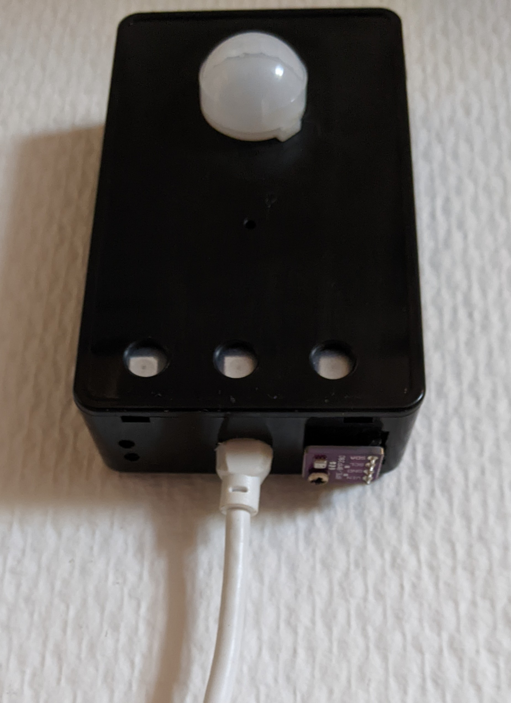

ESPHome Multi-Sensor with Auto-Light
====================================

### [ESPHome](https://esphome.io/) Multi-Sensor for use in conjunction with [Home Assistant](https://www.home-assistant.io/) - with the added functionally of controlling automatic lights ###

This is another take on having a device to control the automatic lights in rooms.

Change the $device_name and $ha_light substitutions before compiling.

Note: To calibrate the 'Ambient Light' calculations, shine bright light on the LDR, click the button 'Light Sensor Update', then cover the LDR and click again.

You will also need to add two Automations to Home Assistant. These two automations will work with any number of devices.

```
alias: Auto-Light On
description: ""
trigger:
  - platform: event
    event_type: esphome.auto_light
    event_data:
      state: "on"
condition: []
action:
  - service: light.turn_on
    target:
      entity_id: "{{ trigger.event.data.entity_id }}"
mode: single

alias: Auto-Light Off
description: ""
trigger:
  - platform: event
    event_type: esphome.auto_light
    event_data:
      state: "off"
condition: []
action:
  - service: light.turn_off
    target:
      entity_id: "{{ trigger.event.data.entity_id }}"
mode: single


```

I also use a couple of Template sensors in HA to give me current Auto-Light settings:

```
- sensor:
    - name: "AutoLight Brightness"
      unique_id: autolight_brightness
      icon: mdi:brightness-auto
      unit_of_measurement: "%"
      state: >-
        
           {{ ( now().minute * -1.5 + 100 ) | int }}
        
          {{ 100 | int }}
        
          {{ 5 | int }}
        
          {{ (( state_attr('sun.sun','elevation') - 6 ) * 4.1 + 100) | int }}
        

    - name: "AutoLight Kelvin"
      unique_id: autolight_kelvin
      icon: mdi:temperature-kelvin
      unit_of_measurement: "K"
      state: >-
        
          {{ ( now().minute * -18 + 3820 ) | int }}
        
          {{ 4000 | int }}
        
          {{ 2200 | int }}
        
          {{ ( state_attr('sun.sun','elevation') * 90.0 + 3820) | int }}
        
```

Using these two template sensors the Auto-Light On automation would be:
```
alias: Auto-Light On
description: ""
trigger:
  - platform: event
    event_type: esphome.auto_light
    event_data:
      state: "on"
condition: []
action:
  - service: light.turn_on
    data: 
      brightness_pct: "{{states('sensor.autolight_brightness')}}"
      kelvin: "{{states('sensor.autolight_kelvin')}}"
    target:
      entity_id: "{{ trigger.event.data.entity_id }}"
mode: single

```

## Device Sensors, Controls and Configuration ##




Components
-----------

* Wemos D1 Mini (or Mini Pro)
* LDR Sensor + 4.7k ohm resistor
* BME280 module (or bme680)
* PIR Sensor (I'm using a Panasonic for reliability)
* Short 3-led RGB strip (WS2812b)

I have shoved it all inside a cheap black plastic box.

Here's a picture taken from above, where you can see the little plastic window for the LDR.


And here's one from below where you can see the bme280 sitting outside the box.



Wiring
-------
#### LDR sensor ####
|    LDR |   ESP |
|-------:|-------|
| PIN 1  |  3.3v |
| PIN 2  |   A0  |

#### BME280 module ####
| MODULE |   ESP |
|-------:|-------|
|   SDA  |   D2  |
|   SCL  |   D1  |
|   VCC  |  VCC  |
|   GND  |  GND  |

#### PIR Sensor ####
|  PIR  | ESP |
|------:|-----|
|   OUT |  D0 |
|   VCC | VCC |
|   GND | GND |


#### WS2818 LEDSTRIP ####
|  LED  | ESP |
|------:|-----|
|    D0 |  RX |
|   VCC | VCC |
|   GND | GND |


